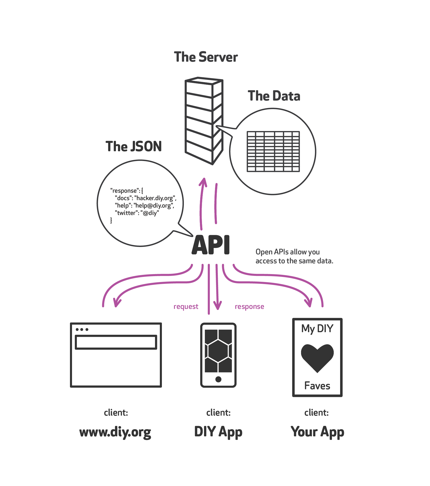
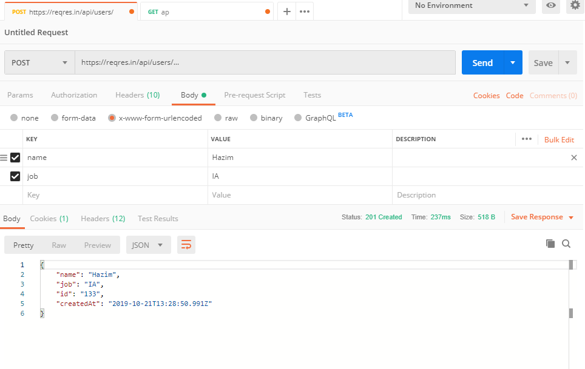
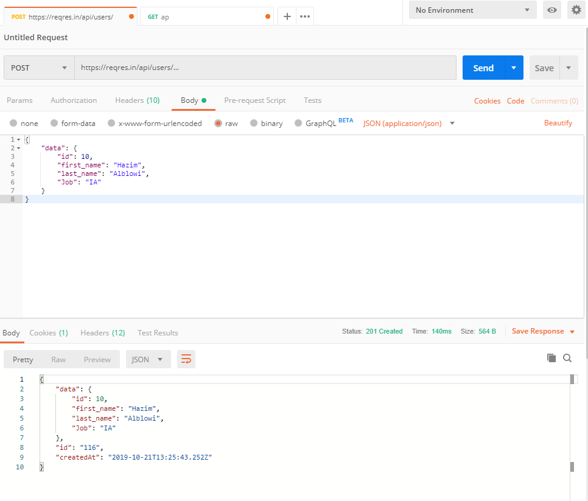

# AJAX + Axios

## HTTP Recap
[How The Internet Works in 5 Minutes](https://www.youtube.com/watch?v=7_LPdttKXPc)

Let's define a few terms:

- *server*: A server is software that processes HTTP requests and builds responses to be sent back to a client.
- *client*: A client is software that makes HTTP requests and processes a server's response.
- *request*: A message sent to a server which requests a document.
- *response*: A message sent to a client which contains a document.
- *protocol*: A rule or set of rules defining proper communication.
How is the web different than the Internet?

The Internet is a telecommunications network. All telecommunications networks—from telegraphs, through phone and radio, and to teletype—facilitate transmission of data from one point to another.

The World Wide Web (WWW, or simply "web") is a distributed, world-wide collection of documents transmitted over the HTTP protocol.


- A client sends a request to a server.
- The server processes the request.
- The response gets sent back to the client.
- The client processes the response.


### Verbs
URLs reveal the identity of the particular host with which we want to communicate, but the action that should be performed on the host is specified via HTTP verbs (or methods, as they are properly called). Of course, there are several actions that a client would like the host to perform. HTTP has formalised on a few that capture the essentials that are universally applicable for all kinds of applications.

These request verbs are:

- **GET:** fetch an existing resource. The URL contains all the necessary information the server needs to locate and return the resource.
- **POST:** create a new resource. POST requests usually carry a payload that specifies the data for the new resource.
- **PUT/PATCH:** update an existing resource. The payload may contain the updated data for the resource.
- **DELETE:** delete an existing resource.

The above four verbs are the most popular, and most tools and frameworks explicitly expose these request verbs. PUT and DELETE are sometimes considered specialised versions of the POST verb, and they may be packaged as POST requests with the payload containing the exact action: create, update or delete.

Examples:

- GET http://www.example.com/customers/12345
- GET http://www.example.com/customers/12345/orders
- GET http://www.example.com/buckets/sample

https://www.restapitutorial.com/lessons/httpmethods.html

[Let's watch a video!](https://www.youtube.com/watch?v=kBXQZMmiA4s)

<br>

## API


In computer science API application programming interface is quite a broad term which can be confusing.

However, The term now commonly refers to web URLs that can be accessed for raw data.

When we think about APIs within the context of web application development we can simply think about it as a website that returns JSON instead of HTML so that a computer can use the data to do something instead of a human.

It allows a programme to interface with a website over the internet so that it can use that websites' data.

**Q: Why use api?**
>Why recreate data when we don't have to? Think about past projects or ideas that would be easier if you could pull in data already gathered elsewhere.
APIs can provide us with data that we would otherwise not be able to create ourselves.

Many web sites have their own data, but they can pull in other data. For example, many news sites have a weather widget. This widget gets its data from a weather resource.

There are many APIs that can be used by individuals and companies. Some are totally free, some are available for a small fee, and some are really expensive.

Let's check out a few API's:

- [Dog API](https://dog.ceo/dog-api/)
- [Star Wars API](https://swapi.co/)
- [Pokemon API](https://pokeapi.co/)
- [Game of Thrones API](https://anapioficeandfire.com/)


<br>


## Postman

[Postman Docs](https://www.getpostman.com/)


Postman is a tool to test and build APIs. It's super helpful to test requests that will require a form (`POST` or `PUT/PATCH`) or a link/button (`DELETE`).

<br>

##  API Requests

[Reqres.in Docs](https://reqres.in/)


#### CREATE/POST DOCS


#### CREATE WITH A FORM



#### CREATE WITH RAW JSON



<br>
## JSON


JSON stands for **J**ava**S**cript **O**bject **N**otation. It is a lightweight way for storing and transporting data.
JSON is:

- a data exchange format.
- a way to represent data.
- a string with a specific format.

JSON is not:

- a dictionary.
- an object.
- an object literal.

JSON does not support:

- comments.
- methods.

>JSON is just one format that we can send and receive over the internet. There are some others like XML that you might see. However, JSON is the most common and the easiest to use.


###### JSON Example

```json
{
     "firstName": "John",
     "lastName": "Smith",
     "address": {
         "streetAddress": "21 2nd Street",
         "city": "New York",
         "state": "NY",
         "postalCode": 10021
     },
     "phoneNumbers": [
         "212 555-1234",
         "646 555-4567"
     ]
 }
```
We can add a [chrome extension](https://chrome.google.com/webstore/detail/json-formatter/bcjindcccaagfpapjjmafapmmgkkhgoa?hl=en) to make JSON easier to read.
<br>


## AJAX

AJAX = Asynchronous JavaScript And XML.

AJAX is not a programming language.

AJAX just uses a combination of:

- A browser built-in XMLHttpRequest object (to request data from a web server)
- JavaScript and HTML DOM (to display or use the data)

AJAX allows developers to:
- Read data from a web server - after a web page has loaded
- Update a web page without reloading the page
- Send data to a web server - in the background

AJAX is a misleading name. AJAX applications might use XML to transport data, but it is equally common to transport data as plain text or JSON text.

AJAX allows web pages to be updated asynchronously by exchanging data with a web server behind the scenes. This means that it is possible to update parts of a web page, without reloading the whole page.

##### XML and JSON
Back in the day, APIs used to send data in XML format,which is where the X in AJAX comes from. However, JSON has become the predominant way to send data over the internet.

Even though JSON has become the preferred method of data transfer, no one seems in a hurry to start calling AJAX AJAJ.


When we will use AJAX, we will be sending and receiving JSON.
Let's take a look at a few sites that use AJAX:

- https://www.google.com/maps
- https://docs.google.com/spreadsheets/d/1wAtHJh3lMwQxfZ3Uqtow6KNd06h2OSJJ0mXH0b-R6Xo/edit

What would happen if we disabled javascript and tried to use those sites?

We make AJAX requests with 

- [JS XMLHttpRequest](https://developer.mozilla.org/en-US/docs/Web/API/XMLHttpRequest/Using_XMLHttpRequest)
- [JS Fetch](https://developer.mozilla.org/en-US/docs/Web/API/Fetch_API)
- [jQuery AJAX](http://api.jquery.com/jquery.ajax/)
- [Axios](https://github.com/axios/axios)
- many other helpful AJAX libraries

<br>

## Axios

[Axios Documentation](https://github.com/axios/axios)

We will be using Axios for our AJAX requests.  Axios is a very popular library and we can use it in the browser and with node.

### Request
- method
    - GET
    - POST
    - DELETE
    - PATCH/PUT
- url
    - https://swapi.co/api/people/1
    - https://pokeapi.co/api/v2/pokemon/2
- data (optional)

*Get Request Example*

```js
axios({
  method: 'get',
  url: 'https://swapi.co/api/people/1'
});
```

*Post Request Example*

```js
axios({
  method: 'post',
  url: 'https://swapi.co/api/people/1',
  data: {
    firstName: 'brunos',
    lastName: 'ilovenodejs'
  }
});
```

### Response Object

- *data*: the payload returned from the server. By default, Axios expects JSON and will parse this back into a JavaScript object for you.
- *status*: the HTTP code returned from the server.
- *statusText*: the HTTP status message returned by the server.


### Error Object

- *message*: the error message text.
- *response*: the response object (if received) as described in the previous section.
- *request*: the actual XMLHttpRequest object (when running in a browser).

### Handling Responses

Since an AJAX call is asynchronous, we need to handle its response in a particular way.  

You may have already used some asynchronous javascript with `setTimeout()`.  Potentially you ran into a problem with it.  

[Let's take a look at how asynchronous javascript works!](https://www.youtube.com/watch?v=8aGhZQkoFbQ)

To work with asynchronous javascript, we are going to use promises and a promise chain.

### JavaScript Promises

Remember, JavaScript is _Asynchronous_. It doesn't wait for one thing to finish before moving on to the next thing. So we must figure out a way to wait for our Axios call to finish getting all the data before we start working with it.

To work with asynchronous javascript, we are going to use `promises`. 
 
 A `promise` is a special JavaScript object that can wait for a response and `then` do something. It is a way of writing code that says 'hey, wait for me, and I _promise_ I'll send you a response soon. Then, you can do what you need to do'

After calling the initial function (in our case `axios()`), all we need to do is chain the other functions after it:

- `.then()` is executed if the promise is fulfilled. 

- `.catch()` is executed instead of `.then()` if the promise has failed in some way.


```js
// Example 1
axios({
  url: 'https://dog.ceo/api/breed/boxer/images/random',
  method: 'get',
})
.then()
.catch() // .then and .catch are chained at the end of the request 
```

It is easier to ready if we place them on the next line

```js
axios({
  url: 'https://dog.ceo/api/breed/boxer/images/random',
  method: 'get',
})
.then() // .then wants a function to run if the request is succesful
.catch() // .catch wants a function to run if the request is succesful
```

The `.then` and `.catch` method want us to pass them functions to run.
`.then` wants a function to run if the request succeeds 
`.catch` wants a function to run if the request fails

```js
axios({
  url: 'https://dog.ceo/api/breed/boxer/images/random',
  method: 'get',
})
.then(doGoodStuff) 
.catch(doErrorStuff) 
```

We often use anonymous, fat arrow functions.

```js
axios({
  url: 'https://dog.ceo/api/breed/boxer/images/random',
  method: 'get',
})
.then(() => {
    // code for if the request succeeds
}) 
.catch(()=>{
    // code for if the request fails
}) 
```

`axios` will pass our functions the `response` or `error` object so that we can access the data that the API returns to us.

```js
axios({
  url: 'https://dog.ceo/api/breed/boxer/images/random',
  method: 'get',
})
.then((response) => {
    // code for if the request succeeds
    console.log(response)
}) 
.catch((error)=>{
    // code for if the request fails
    console.log(error)
}) 
```


